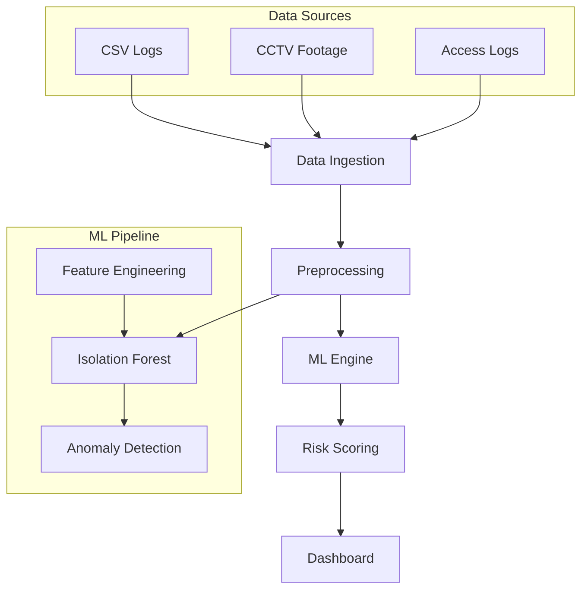

# 🔍 SPi - AI-Based Insider Threat Detection System

<div align="center">


<br><br>


**Advanced AI-powered security solution for detecting insider threats through behavioral analysis**

[🚀 Live Demo](#) • [📖 Documentation](#) • [🐛 Report Issues](https://github.com/your-repo/issues)

---

</div>

## 📋 Table of Contents

- [🔍 Overview](#-overview)
- [✨ Key Features](#-key-features)
- [🏗️ Architecture](#️-architecture)
- [🚀 Quick Start](#-quick-start)
- [📊 Usage Guide](#-usage-guide)
- [🔧 Technical Details](#-technical-details)
- [📈 Risk Assessment](#-risk-assessment)
- [🛠️ Development](#️-development)
- [🤝 Contributing](#-contributing)
- [📄 License](#-license)
- [👥 Team](#-team)

---

## 🔍 Overview

**SPi (Security Pattern Intelligence)** is a cutting-edge AI-powered insider threat detection system that revolutionizes enterprise security by combining machine learning algorithms with behavioral pattern analysis. The system identifies malicious or negligent activities by correlating digital footprints with physical access patterns, detecting anomalies that traditional rule-based systems often miss.

### 🎯 Problem Statement

Insider threats account for **30-40% of all data breaches** (Verizon DBIR 2024). Traditional security systems focus on external threats, leaving organizations vulnerable to insider attacks. SPi addresses this critical gap by providing intelligent, automated threat detection.

### 💡 Solution Approach

SPi utilizes **Isolation Forest** machine learning algorithm combined with computer vision to analyze:
- **Digital Behavioral Logs**: Login patterns, USB usage, file access frequency
- **Physical Access Patterns**: Zone access logs, CCTV footage analysis
- **Anomaly Detection**: Statistical outliers and suspicious behavioral patterns

---

## ✨ Key Features

### 🔐 Security Features
- ✅ **Real-time Threat Detection** - Continuous monitoring and analysis
- ✅ **Multi-factor Risk Assessment** - Comprehensive scoring algorithm
- ✅ **Behavioral Pattern Analysis** - Advanced ML-driven insights
- ✅ **Anomaly Detection** - Isolation Forest algorithm implementation

### 📊 Analytics & Reporting
- 📈 **Interactive Dashboards** - Real-time risk visualization
- 📋 **Detailed Employee Profiles** - Individual risk assessments
- 🎯 **Risk Categorization** - Low/Medium/High risk classification
- 📊 **Comprehensive Reporting** - Exportable security reports

### 🎨 User Experience
- 🌙 **Dark Theme Interface** - Modern, professional UI
- 📱 **Responsive Design** - Works on all devices
- ⚡ **Fast Performance** - Optimized React + TypeScript
- 🔍 **Advanced Search** - Quick employee lookup

---

## 🏗️ Architecture



### 🏛️ System Components

| Component | Technology | Purpose |
|-----------|------------|---------|
| **Frontend** | React + TypeScript | User interface and dashboards |
| **ML Engine** | Isolation Forest | Anomaly detection algorithm |
| **Data Processing** | Python/Pandas | Log analysis and preprocessing |
| **Visualization** | Recharts | Interactive charts and graphs |
| **State Management** | React Context | Application state handling |

---

## 🚀 Quick Start

### 📋 Prerequisites

- **Node.js** (v18 or higher)
- **npm** or **yarn**
- **Modern web browser**

### ⚡ Installation

1. **Clone the repository**
   ```bash
   git clone https://github.com/your-username/spi-insider-threat-detection.git
   cd spi-insider-threat-detection
   ```

2. **Install dependencies**
   ```bash
   npm install
   ```

3. **Start development server**
   ```bash
   npm run dev
   ```

4. **Open your browser**
   ```
   Navigate to http://localhost:3002
   ```

### 🏃‍♂️ Build for Production

```bash
# Build the application
npm run build

# Preview production build
npm run preview
```

---

## 📊 Usage Guide

### 🔐 Authentication

The system includes pre-configured user accounts:

| Role | Username | Password | Permissions |
|------|----------|----------|-------------|
| **Security Admin** | `admin` | `password123` | Full system access |
| **Threat Analyst** | `analyst` | `spy-detector-2025` | Analysis & reporting |

### 📋 Workflow

1. **📤 Data Ingestion**
   - Upload CSV files containing employee logs
   - Supported formats: Login logs, USB events, file access records

2. **🔍 Risk Assessment**
   - Navigate to "Risk Assessment" tab
   - View categorized employee risks (Low/Medium/High)
   - Click risk level buttons to filter employees

3. **👤 Individual Analysis**
   - Use "Individual Risk Assessment" search
   - Enter employee ID for detailed profile
   - Review comprehensive risk analysis and recommendations

4. **📈 Analytics**
   - Access "Analytics" tab for visual insights
   - View risk distribution charts and trends

---

## 🔧 Technical Details

### 🧠 Machine Learning Pipeline

```python
# Isolation Forest Implementation
from sklearn.ensemble import IsolationForest

# Feature Engineering
features = ['login_count', 'night_logins', 'usb_count', 'file_activity_count']

# Model Training
model = IsolationForest(contamination=0.1, random_state=42)
model.fit(employee_features)

# Anomaly Scoring
anomaly_scores = model.decision_function(employee_features)
risk_scores = (anomaly_scores - anomaly_scores.min()) / (anomaly_scores.max() - anomaly_scores.min()) * 100
```

### 📊 Risk Scoring Algorithm

- **Low Risk**: Score < 25 (Normal behavior)
- **Medium Risk**: Score 25-50 (Monitor closely)
- **High Risk**: Score > 50 (Immediate attention required)

### 🎨 UI Components

- **Framework**: React 19 with TypeScript
- **Styling**: Tailwind CSS with custom dark theme
- **Charts**: Recharts for data visualization
- **Icons**: Heroicons for consistent iconography

---

## 📈 Risk Assessment

### 🎯 Risk Categories

| Risk Level | Score Range | Color | Action Required |
|------------|-------------|-------|----------------|
| **Low** | 0-24 | 🟢 Green | Standard monitoring |
| **Medium** | 25-49 | 🟡 Yellow | Increased surveillance |
| **High** | 50-100 | 🔴 Red | Immediate investigation |

### 📋 Assessment Factors

- **Login Patterns**: Frequency and timing analysis
- **USB Activity**: Device connection monitoring
- **File Operations**: Access and modification tracking
- **Off-hours Usage**: After-hours system access
- **Anomaly Detection**: Statistical outlier identification

---

## 🛠️ Development

### 🏃‍♂️ Available Scripts

```bash
# Development server
npm run dev

# Production build
npm run build

# Build preview
npm run preview

# Type checking
npm run type-check
```

### 🗂️ Project Structure

```
spi-insider-threat-detection/
├── public/
│   ├── images/
│   └── data/
├── src/
│   ├── components/
│   │   ├── Analytics.tsx
│   │   ├── Dashboard.tsx
│   │   ├── DataInput.tsx
│   │   ├── Login.tsx
│   │   ├── Results.tsx
│   │   └── Introduction.tsx
│   ├── DataContext.tsx
│   ├── types.ts
│   └── App.tsx
├── package.json
├── tsconfig.json
├── vite.config.ts
└── README.md
```

### 🔧 Configuration

**TypeScript Configuration** (`tsconfig.json`):
```json
{
  "compilerOptions": {
    "target": "ES2020",
    "lib": ["ES2020", "DOM", "DOM.Iterable"],
    "module": "ESNext",
    "skipLibCheck": true,
    "moduleResolution": "bundler",
    "allowImportingTsExtensions": true,
    "resolveJsonModule": true,
    "isolatedModules": true,
    "noEmit": true,
    "jsx": "react-jsx",
    "strict": true,
    "noUnusedLocals": true,
    "noUnusedParameters": true,
    "noFallthroughCasesInSwitch": true
  },
  "include": ["src"],
  "references": [{ "path": "./tsconfig.node.json" }]
}
```

---

## 🤝 Contributing

We welcome contributions! Please see our [Contributing Guidelines](CONTRIBUTING.md) for details.

### 🚀 How to Contribute

1. Fork the repository
2. Create a feature branch (`git checkout -b feature/amazing-feature`)
3. Commit your changes (`git commit -m 'Add amazing feature'`)
4. Push to the branch (`git push origin feature/amazing-feature`)
5. Open a Pull Request

### 🐛 Bug Reports & Feature Requests

- 🐛 **Bug Reports**: [GitHub Issues](https://github.com/your-repo/issues)
- 💡 **Feature Requests**: [GitHub Discussions](https://github.com/your-repo/discussions)
- 📧 **Security Issues**: security@yourcompany.com

---

## 📄 License

This project is licensed under the MIT License - see the [LICENSE](LICENSE) file for details.

```
MIT License

Copyright (c) 2024 SPi Security Solutions

Permission is hereby granted, free of charge, to any person obtaining a copy
of this software and associated documentation files (the "Software"), to deal
in the Software without restriction, including without limitation the rights
to use, copy, modify, merge, publish, distribute, sublicense, and/or sell
copies of the Software...
```

---

## 👥 Team

### 👨‍💼 Core Team

- **Security Architect** - System design and ML implementation
- **Frontend Developer** - React/TypeScript development
- **Data Scientist** - ML algorithms and risk modeling
- **UI/UX Designer** - Interface design and user experience

### 🙏 Acknowledgments

- **Scikit-learn** for the Isolation Forest implementation
- **React Community** for the excellent framework
- **Tailwind CSS** for the utility-first styling approach

---

<div align="center">

**Made with ❤️ for Enterprise Security**

[](https://github.com/your-username/spi-insider-threat-detection)
[](https://github.com/your-username/spi-insider-threat-detection)

---

*Protecting organizations from insider threats, one anomaly at a time.*

</div>
