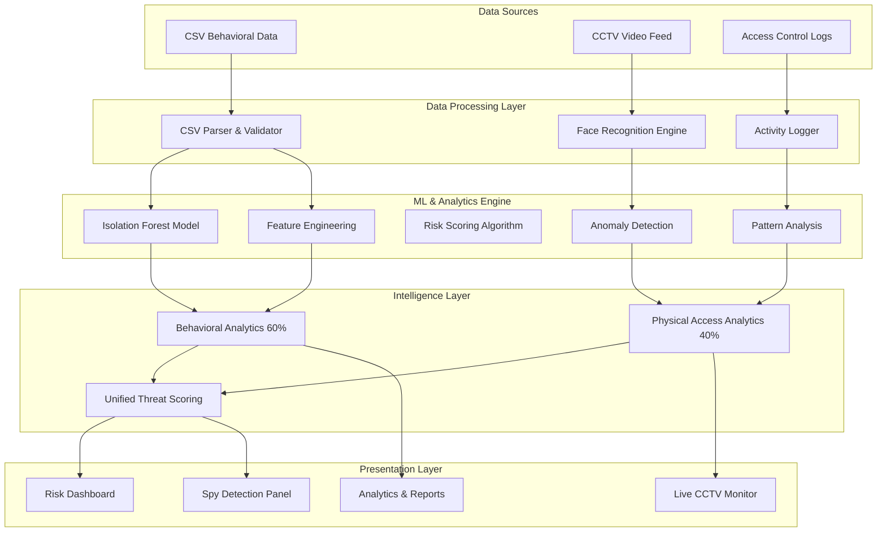

# 🔍 SPi - Advanced AI-Powered Insider Threat Detection System

<div align="center">


<br><br>


**Enterprise-grade security solution combining behavioral analytics, CCTV monitoring, and AI-powered threat detection**

[🚀 Live Demo](#) • [📖 Documentation](#) • [🐛 Report Issues](https://github.com/your-repo/issues)

---

</div>

## 📋 Table of Contents

- [🔍 Overview](#-overview)
- [✨ Key Features](#-key-features)
- [🏗️ Architecture](#️-architecture)
- [🚀 Quick Start](#-quick-start)
- [📊 Usage Guide](#-usage-guide)
- [🔧 Technical Details](#-technical-details)
- [📈 Risk Assessment](#-risk-assessment)
- [🛠️ Development](#️-development)
- [🤝 Contributing](#-contributing)
- [📄 License](#-license)
- [👥 Team](#-team)

---

## 🔍 Overview

**SPi (Security Pattern Intelligence)** is an enterprise-grade AI-powered insider threat detection system that revolutionizes security operations by integrating behavioral analytics, real-time CCTV monitoring, and advanced machine learning. The system provides comprehensive threat detection by combining digital forensics with physical access control, offering a multi-layered defense against insider threats.

### 🎯 Problem Statement

Insider threats account for **30-40% of all data breaches** (Verizon DBIR 2024) and cause an average loss of **$15.38 million per incident**. Traditional security systems focus primarily on external threats, leaving organizations vulnerable to malicious insiders, negligent employees, and compromised credentials. SPi addresses this critical security gap with intelligent, real-time threat detection and comprehensive risk assessment.

### 💡 Solution Approach

SPi employs a **dual-source intelligence system** combining:

**1. Behavioral Analytics (60% Weight)**
- **Isolation Forest ML Algorithm**: Anomaly detection across 38+ behavioral attributes
- **Activity Logging**: Real-time tracking of file operations, USB usage, email patterns
- **OCEAN Personality Model**: Personality trait analysis for behavioral baseline
- **Pattern Recognition**: Login frequency, night access, system usage patterns

**2. Physical Access Monitoring (40% Weight)**
- **Real-time CCTV Face Recognition**: Live monitoring with confidence scoring
- **Zone-based Authorization**: Restricted area access control (CEO, Financial, Server, R&D)
- **Off-hours Detection**: Unauthorized access attempt identification
- **Access Timeline**: Chronological incident tracking with alerts

**3. Unified Threat Scoring**
```
Spy Score = (Behavioral Risk × 0.6) + (Physical Access Risk × 0.4)
```

This convergent evidence approach reduces false positives and provides actionable intelligence for security teams.

---

## ✨ Key Features

### 🔐 Security & Detection
- ✅ **Real-time Threat Detection** - Continuous monitoring with 3-second refresh intervals
- ✅ **Spy Detection System** - Dual-source threat verification (CSV + CCTV)
- ✅ **Live CCTV Monitoring** - Real-time face recognition with confidence scoring
- ✅ **Multi-factor Risk Assessment** - 8-component comprehensive scoring
- ✅ **Behavioral Pattern Analysis** - ML-driven insights with OCEAN personality model
- ✅ **Anomaly Detection** - Isolation Forest algorithm with 38+ features
- ✅ **Zone-based Access Control** - Restricted area monitoring (4 high-security zones)
- ✅ **Off-hours Detection** - Automated alerts for suspicious timing patterns

### 📊 Analytics & Insights
- 📈 **Unified Risk Dashboard** - Multi-tab interface with advanced filtering
- 📋 **Activity Insights** - Comprehensive behavioral analytics dashboard
- ⏱️ **Activity Timeline** - Chronological event tracking with severity indicators
- 🎯 **Risk Categorization** - Critical/High/Medium/Low classification
- 📊 **Interactive Visualizations** - Real-time charts with Recharts
- 🔍 **Advanced Search** - Multi-field search (ID, name, department, all fields)
- 📉 **Trend Analysis** - 7-day risk trends and pattern identification
- 🎲 **Peer Comparison** - Department-wide benchmarking

### 📝 Reporting & Management
- 📄 **Automated Report Generation** - Detailed incident reports with evidence
- 💾 **Export Capabilities** - One-click download of findings (TXT format)
- 🚨 **Real-time Alerts** - Live threat notifications every 3 seconds
- 📋 **Audit Trail** - Complete activity logging for compliance
- 🎯 **Actionable Recommendations** - Context-specific mitigation strategies
- 👤 **Detailed Employee Profiles** - Comprehensive risk breakdowns
- 📊 **Risk Management Dashboard** - Executive-level overview with KPIs

### 🎨 User Experience
- 🌙 **Modern Dark Theme** - Professional UI optimized for SOC environments
- 📱 **Responsive Design** - Works seamlessly across all devices
- ⚡ **Fast Performance** - Optimized React 19 + TypeScript + Vite
- 🔒 **Secure Authentication** - Role-based access control (Admin/Analyst)
- 🎭 **Interactive Components** - Smooth animations and transitions
- 🔔 **Live Notifications** - Real-time incident alerts

---

## 🏗️ Architecture



### 🏛️ System Components

| Component | Technology | Purpose |
|-----------|------------|---------|
| **Frontend** | React 19 + TypeScript | User interface, dashboards, and real-time monitoring |
| **ML Engine** | Isolation Forest (Scikit-learn) | Behavioral anomaly detection across 38+ features |
| **Face Recognition** | Python face_recognition library | Real-time CCTV identity verification |
| **Data Processing** | Python + Pandas | CSV parsing, feature engineering, data validation |
| **Visualization** | Recharts | Interactive charts, risk trends, analytics |
| **State Management** | React Context API | Global application state with DataProvider |
| **Backend API** | Python Flask | Video processing, face detection, ML inference |
| **Icon Library** | Lucide React | Modern, consistent UI iconography |
| **Build Tooling** | Vite 6.2 | Lightning-fast HMR and optimized production builds |

### 📊 Data Flow Architecture

```
Employee Behavioral Data (CSV)          CCTV Video Stream
         ↓                                      ↓
   [38 Attributes]                      [Face Recognition]
         ↓                                      ↓
  Feature Engineering              Authorization Verification
         ↓                                      ↓
  Isolation Forest ML              Zone Access Validation
         ↓                                      ↓
  Anomaly Scores (0-100)           Access Risk Score (0-100)
         ↓                                      ↓
         └──────────→ [Risk Fusion Engine] ←───┘
                            ↓
                   Unified Threat Score
                   (CSV × 0.6) + (CCTV × 0.4)
                            ↓
         ┌──────────────────┼──────────────────┐
         ↓                  ↓                   ↓
    Critical (80+)      High (60-79)       Medium/Low
         ↓                  ↓                   ↓
   Immediate Alert    Investigation       Monitor
```

---

## 🚀 Quick Start

### 📋 Prerequisites

- **Node.js** (v18 or higher)
- **npm** or **yarn**
- **Modern web browser**

### ⚡ Installation

1. **Clone the repository**
   ```bash
   git clone https://github.com/your-username/spi-insider-threat-detection.git
   cd spi-insider-threat-detection
   ```

2. **Install dependencies**
   ```bash
   npm install
   ```

3. **Start development server**
   ```bash
   npm run dev
   ```

4. **Open your browser**
   ```
   Navigate to http://localhost:3002
   ```

### 🏃‍♂️ Build for Production

```bash
# Build the application
npm run build

# Preview production build
npm run preview
```

---

## 📊 Usage Guide

### 🔐 Authentication

The system includes pre-configured user accounts:

| Role | Username | Password | Permissions |
|------|----------|----------|-------------|
| **Security Admin** | `admin` | `password123` | Full system access, all features |
| **Threat Analyst** | `analyst` | `spy-detector-2025` | Analysis, reporting, monitoring |

### 🚀 System Navigation

#### 📑 **6 Main Tabs**

1. **📋 Overview** - System introduction and capabilities overview
2. **📤 Data Ingestion** - Upload and process employee behavioral data
3. **🎯 Risk Assessment** - Unified dashboard with employee risk profiles
4. **📈 Analytics** - Visual insights and trend analysis
5. **🕵️ Spy Detection** - Combined CSV + CCTV threat verification
6. **📹 Live CCTV Monitor** - Real-time face recognition and access control

### 📋 Complete Workflow

#### **Step 1: Data Ingestion** 📤

1. Navigate to "Data Ingestion" tab
2. Upload CSV file with employee behavioral data
   - **Supported formats**: Comprehensive employee data with 38+ attributes
   - **Sample datasets**: Located in `/data/` directory
     - `comprehensive_employee_data_1000.csv` (1,000 records)
     - `comprehensive_employee_data_5000.csv` (5,000 records)
   - **Required columns**: user, login_count, night_logins, usb_count, file_activity, emails, etc.
3. System automatically:
   - Parses and validates data
   - Extracts 38 behavioral features
   - Runs Isolation Forest ML model
   - Calculates individual risk scores
   - Categorizes employees by risk level

#### **Step 2: Risk Assessment** 🎯

**Unified Risk Dashboard Features:**

- **📊 Overview Tab**: 
  - Total employees analyzed
  - Risk distribution pie chart (Critical/High/Medium/Low)
  - 7-day risk trend analysis
  - Top 10 at-risk employees list
  - Quick statistics dashboard

- **🔍 Advanced Search**:
  - Search by Employee ID
  - Search by Name
  - Search by Department
  - Search All Fields
  - Real-time result filtering

- **👤 Individual Risk Details Tab**:
  - **8 Risk Metric Cards**:
    - Overall Risk Score
    - File Activity Risk
    - USB Activity Risk
    - Email Communication Risk
    - Login Pattern Risk
    - Behavioral Risk (OCEAN)
    - Session Duration
    - Night Login Count
  
  - **File Operations Panel**:
    - Files opened, copied, deleted, downloaded
    - Sensitive files accessed (🔴 highlighted)
    - Unique files touched
  
  - **Systems & Devices Panel**:
    - Unique PCs accessed
    - USB connection count
    - Systems accessed (SAP, Salesforce, HRMS, etc.)
  
  - **Recommendations**:
    - Context-specific mitigation actions
    - Severity-based prioritization

- **⏱️ Activity Log Tab**:
  - Complete chronological timeline
  - Filter by activity type
  - Filter by anomaly status
  - Severity indicators (🔴🟡🟢)
  - Expandable activity details

#### **Step 3: Analytics Dashboard** 📈

Visual insights including:
- Risk distribution across organization
- Department-wise risk comparison
- Activity pattern analysis
- Trend identification
- Statistical summaries
- Interactive charts and graphs

#### **Step 4: Spy Detection** 🕵️

**Combined Intelligence Analysis:**

1. **CSV Behavioral Data** (automatically loaded from Step 1)
   - 60% weight in final score
   - Analyzes: file operations, USB usage, emails, login patterns

2. **CCTV Video Upload**:
   - Upload MP4 video file (50+ seconds recommended)
   - Define authorized employee list
   - System runs face recognition
   - Detects unauthorized access
   - Identifies off-hours entry
   - Calculates physical access risk (40% weight)

3. **Unified Threat Score**:
   ```
   Spy Score = (Behavioral Risk × 0.6) + (CCTV Access Risk × 0.4)
   ```

4. **Results**:
   - **CRITICAL THREATS** (80-100): Immediate investigation required
   - **HIGH RISK** (60-79): Enhanced monitoring recommended
   - **MEDIUM/LOW** (0-59): Standard surveillance

5. **Evidence Compilation**:
   - Behavioral anomalies
   - Unauthorized access incidents
   - Convergent evidence analysis
   - Verdict: **SPY** / **NOT SPY**

#### **Step 5: Live CCTV Monitor** 📹

**Real-time Access Control System:**

- **Live Detection Feed**:
  - Simulated real-time face detection
  - Updates every 3 seconds
  - Confidence score display
  - Identity verification

- **4 Restricted Zones**:
  - 🏢 CEO Office
  - 💰 Financial Department
  - 🖥️ Server Room
  - 🧪 R&D Lab

- **Access Verification**:
  - Authorization checking
  - Real-time grant/deny decisions
  - **SUSPICIOUS** flags for anomalies

- **Alert Timeline**:
  - Chronological incident log
  - Color-coded by threat level
  - Automatic threat detection
  - Live updates every 3 seconds

- **Risk Management Dashboard**:
  - Critical/High/Medium/Low risk counters
  - Employee risk profiles
  - Incident summaries

- **Report Generation**:
  - One-click detailed report download
  - Includes: incident summary, behavioral analysis, CCTV violations
  - Evidence compilation with insider threat verdict
  - Immediate action recommendations
  - Audit trail and compliance documentation

---

## 🔧 Technical Details

### 🧠 Machine Learning Pipeline

```python
# Isolation Forest Implementation with 38+ Features
from sklearn.ensemble import IsolationForest
import pandas as pd

# Comprehensive Feature Engineering
features = [
    # Login & Access Patterns
    'login_count', 'night_logins', 'avg_session_duration', 'total_session_duration',
    
    # File Operations
    'file_activity_count', 'files_opened', 'files_deleted', 'files_copied',
    'files_downloaded', 'files_uploaded', 'files_edited', 'files_accessed',
    'sensitive_files_accessed', 'unique_files_accessed',
    
    # Device Activity
    'usb_count', 'usb_connections', 'usb_disconnections', 'unique_pcs',
    
    # Communication
    'external_mails', 'emails_sent', 'emails_internal', 'emails_external',
    'internal_emails_to_external_ratio',
    
    # System Access
    'http_requests', 'unique_urls',
    
    # OCEAN Personality Model
    'openness', 'conscientiousness', 'extraversion', 'agreeableness', 'neuroticism'
]

# Model Configuration
model = IsolationForest(
    contamination=0.1,      # Expect 10% anomalies
    random_state=42,        # Reproducible results
    n_estimators=100,       # Ensemble size
    max_samples='auto'
)

# Training
model.fit(employee_features[features])

# Anomaly Detection & Scoring
anomaly_scores = model.decision_function(employee_features)
predictions = model.predict(employee_features)  # -1 = anomaly, 1 = normal

# Normalize to 0-100 scale
risk_scores = (anomaly_scores - anomaly_scores.min()) / \
              (anomaly_scores.max() - anomaly_scores.min()) * 100
```

### 📊 Advanced Risk Scoring Algorithm

**Multi-Component Risk Assessment:**

```python
def calculate_comprehensive_risk(employee_data):
    """
    Calculates risk across 8 major components
    Total: 0-100 points
    """
    
    # 1. File Activity Risk (0-30 points)
    file_risk = calculate_file_risk(
        files_deleted,           # High weight
        sensitive_files_accessed, # Very high weight
        files_downloaded,        # Medium weight
        total_file_operations    # Base weight
    )
    
    # 2. USB Activity Risk (0-25 points)
    usb_risk = calculate_usb_risk(
        usb_connections,         # Connection frequency
        usb_during_off_hours,    # Timing analysis
        usb_patterns             # Unusual patterns
    )
    
    # 3. Email Activity Risk (0-20 points)
    email_risk = calculate_email_risk(
        external_emails,         # External communication
        email_attachments,       # File sharing
        recipient_analysis       # Distribution patterns
    )
    
    # 4. Login Pattern Risk (0-15 points)
    login_risk = calculate_login_risk(
        night_logins,            # Off-hours access
        login_frequency,         # Access patterns
        session_duration         # Time analysis
    )
    
    # 5. HTTP Activity Risk (0-10 points)
    http_risk = calculate_http_risk(
        http_requests,           # Volume analysis
        unique_urls,             # Diversity check
        suspicious_domains       # Threat intelligence
    )
    
    # 6. Behavioral Risk (ML-based)
    behavioral_risk = isolation_forest_score  # From ML model
    
    # 7. OCEAN Personality Deviation
    personality_risk = calculate_personality_deviation(
        openness, conscientiousness, extraversion, 
        agreeableness, neuroticism
    )
    
    # 8. Composite Score
    total_risk = (
        file_risk +
        usb_risk +
        email_risk +
        login_risk +
        http_risk +
        behavioral_risk +
        personality_risk
    )
    
    return min(total_risk, 100)  # Cap at 100
```

### 🎯 Risk Categories & Thresholds

| Risk Level | Score Range | Color | Behavior Profile | Action Required |
|------------|-------------|-------|------------------|-----------------|
| **CRITICAL** | 80-100 | 🔴 Red | Severe anomalies, multiple red flags | Immediate investigation, access suspension |
| **HIGH** | 60-79 | 🟠 Orange | Significant deviations, concerning patterns | Enhanced monitoring, manager notification |
| **MEDIUM** | 40-59 | 🟡 Yellow | Moderate anomalies, some concerns | Increased surveillance, activity review |
| **LOW** | 0-39 | 🟢 Green | Normal behavior, within baselines | Standard monitoring |

### 🎨 UI Components Architecture

**Technology Stack:**

- **Framework**: React 19 with TypeScript (strict mode)
- **Styling**: Tailwind CSS with custom dark theme palette
- **Charts**: Recharts 3.6.0 for responsive data visualization
- **Icons**: Lucide React 0.563.0 for modern iconography
- **State**: React Context API with DataProvider pattern
- **Routing**: Tab-based navigation with locked state management

**Component Hierarchy:**

```
App.tsx
├── Login.tsx (Authentication)
└── Dashboard.tsx (Main Container)
    ├── Header.tsx (Navigation & User)
    ├── Introduction.tsx (Overview Tab)
    ├── DataInput.tsx (CSV Upload & Processing)
    ├── UnifiedRiskDashboard.tsx (Risk Assessment)
    │   ├── Overview Panel
    │   ├── Search & Filter
    │   ├── Details Panel (8 risk cards)
    │   └── Activity Log Panel
    ├── Analytics.tsx (Visual Insights)
    │   ├── Risk Distribution Charts
    │   ├── Trend Analysis
    │   └── Department Comparisons
    ├── SpyDetection.tsx (CSV + CCTV Fusion)
    │   ├── Video Upload Interface
    │   ├── Authorization Manager
    │   ├── Threat Score Calculator
    │   └── Evidence Compiler
    ├── CCTVMonitoring.tsx (Real-time Access Control)
    │   ├── Live Detection Feed
    │   ├── Zone Authorization
    │   ├── Alert Timeline
    │   ├── Risk Management Panel
    │   └── Report Generator
    ├── ActivityTimeline.tsx (Event Chronology)
    ├── ActivityInsights.tsx (Behavioral Analytics)
    └── ActivityVisualization.tsx (Charts & Graphs)
```

### 📦 Dataset Specifications

**Available Datasets:**

| Dataset | Records | Employees | Date Range | Size | Attributes |
|---------|---------|-----------|------------|------|------------|
| `comprehensive_employee_data.csv` | 2,556 | 100 | 30 days | ~450 KB | 38 |
| `comprehensive_employee_data_1000.csv` | 1,000 | 40-50 | 21-25 days | ~180 KB | 38 |
| `comprehensive_employee_data_2000.csv` | 2,000 | 75-85 | 24-26 days | ~360 KB | 38 |
| `comprehensive_employee_data_3000.csv` | 3,000 | 115-125 | 26-28 days | ~540 KB | 38 |
| `comprehensive_employee_data_4000.csv` | 4,000 | 155-165 | 28-30 days | ~720 KB | 38 |
| `comprehensive_employee_data_5000.csv` | 5,000 | 195-205 | 30 days | ~900 KB | 38 |

**38 Comprehensive Attributes:**

| Category | Attributes |
|----------|------------|
| **Identity** | user, name, department, job_title |
| **Login Patterns** | login_count, night_logins, avg_session_duration, total_session_duration |
| **File Operations** | file_activity_count, files_opened, files_deleted, files_copied, files_downloaded, files_uploaded, files_edited, files_accessed, sensitive_files_accessed, unique_files_accessed |
| **Device Activity** | usb_count, usb_connections, usb_disconnections, unique_pcs |
| **Communication** | emails_sent, emails_internal, emails_external, external_mails, internal_emails_to_external_ratio |
| **Network Activity** | http_requests, unique_urls |
| **Systems Access** | systems_accessed (SAP, Salesforce, HRMS, etc.) |
| **Personality (OCEAN)** | openness, conscientiousness, extraversion, agreeableness, neuroticism |
| **ML Output** | anomaly_label (-1 or 1), risk_score (0-100), risk_level (LOW/MEDIUM/HIGH/CRITICAL) |

### 🎥 CCTV Integration Details

**Face Recognition Pipeline:**

```python
import face_recognition
import cv2

# Video processing
video_capture = cv2.VideoCapture(video_path)

# Face detection and encoding
face_locations = face_recognition.face_locations(frame)
face_encodings = face_recognition.face_encodings(frame, face_locations)

# Match against known employees
for face_encoding in face_encodings:
    matches = face_recognition.compare_faces(known_encodings, face_encoding)
    face_distances = face_recognition.face_distance(known_encodings, face_encoding)
    
    confidence = (1 - face_distances[best_match_index]) * 100
    
    # Risk factors
    if confidence < 70:  # Low confidence
        risk_score += 20
    if not authorized:   # Unauthorized access
        risk_score += 40
    if is_off_hours():   # After 6 PM or before 6 AM
        risk_score += 25
```

**Access Risk Calculation:**

```python
def calculate_cctv_risk(access_logs, authorized_list):
    """
    CCTV-based risk scoring (0-100)
    """
    risk_score = 0
    
    # Unauthorized zone access
    unauthorized_count = count_unauthorized_accesses(access_logs, authorized_list)
    risk_score += min(unauthorized_count * 10, 40)  # Max 40 points
    
    # Low confidence matches
    low_confidence_count = count_low_confidence_matches(access_logs, threshold=70)
    risk_score += min(low_confidence_count * 5, 25)  # Max 25 points
    
    # Off-hours access
    off_hours_count = count_off_hours_accesses(access_logs)
    risk_score += min(off_hours_count * 7, 25)  # Max 25 points
    
    # Excessive access frequency
    if access_frequency > normal_threshold:
        risk_score += 10
    
    return min(risk_score, 100)
```

---

## 🧮 Detailed Risk Calculation Algorithms

### 1️⃣ **File Activity Risk Algorithm** (0-30 points)

```python
def calculate_file_activity_risk(employee_data, baseline_data):
    """
    Calculates risk score based on file operations
    
    Parameters:
    - files_deleted: Count of deleted files
    - sensitive_files_accessed: Count of sensitive file access
    - files_downloaded: Count of downloads
    - file_operation_anomaly: Deviation from baseline
    
    Returns:
    - risk_score (0-30)
    """
    
    file_risk = 0
    
    # 1. File Deletion Risk (0-15 points)
    #    Deletions are high-risk operations especially for sensitive files
    deletions = employee_data.get('files_deleted', 0)
    sensitive_deletions = employee_data.get('sensitive_files_deleted', 0)
    
    deletion_baseline = baseline_data.get('avg_deletions', 5)
    
    if deletions > deletion_baseline * 3:
        file_risk += 12  # Significant increase
    elif deletions > deletion_baseline * 2:
        file_risk += 8   # Moderate increase
    elif deletions > deletion_baseline:
        file_risk += 4   # Minor increase
    
    # Sensitive file deletion multiplier
    if sensitive_deletions > 0:
        file_risk += min(sensitive_deletions * 2, 8)  # 2 points per sensitive file
    
    # 2. Unusual Access Pattern Risk (0-10 points)
    #    Access files outside normal work scope or off-hours
    accessed_files = employee_data.get('unique_files_accessed', 0)
    access_baseline = baseline_data.get('avg_unique_files', 50)
    
    if accessed_files > access_baseline * 2.5:
        file_risk += 8
    elif accessed_files > access_baseline * 1.5:
        file_risk += 5
    elif accessed_files > access_baseline:
        file_risk += 2
    
    # 3. Download Volume Risk (0-5 points)
    #    Large downloads can indicate data exfiltration
    downloads = employee_data.get('files_downloaded', 0)
    download_baseline = baseline_data.get('avg_downloads', 10)
    
    if downloads > download_baseline * 3:
        file_risk += 5
    elif downloads > download_baseline * 2:
        file_risk += 3
    elif downloads > download_baseline:
        file_risk += 1
    
    # 4. ML Anomaly Adjustment
    #    Isolation Forest flags unusual patterns
    if employee_data.get('anomaly_flag_files') == -1:
        file_risk += 3
    
    return min(file_risk, 30)  # Cap at 30 points


# Example Calculation:
employee = {
    'files_deleted': 48,           # High number
    'sensitive_files_deleted': 3,  # Critical
    'unique_files_accessed': 127,  # High
    'files_downloaded': 34,        # Significant
    'anomaly_flag_files': -1       # ML flagged as anomaly
}

baseline = {
    'avg_deletions': 12,
    'avg_unique_files': 50,
    'avg_downloads': 8
}

file_risk = calculate_file_activity_risk(employee, baseline)
# Expected result: ~25/30 points (HIGH RISK)
```

---

### 2️⃣ **USB Activity Risk Algorithm** (0-25 points)

```python
def calculate_usb_activity_risk(employee_data, baseline_data, time_features):
    """
    Calculates risk score for USB device usage
    
    Parameters:
    - usb_connections: Count of USB device connections
    - usb_off_hours: USB connections during off-hours
    - connection_frequency: Connections per day
    - device_unknown: Connections to unknown devices
    
    Returns:
    - risk_score (0-25)
    """
    
    usb_risk = 0
    
    # 1. Connection Frequency Risk (0-10 points)
    #    Excessive USB usage is suspicious
    usb_connections = employee_data.get('usb_connections', 0)
    usb_baseline = baseline_data.get('avg_usb_connections_per_month', 15)
    
    if usb_connections > usb_baseline * 3:
        usb_risk += 10
    elif usb_connections > usb_baseline * 2:
        usb_risk += 7
    elif usb_connections > usb_baseline * 1.5:
        usb_risk += 4
    elif usb_connections > usb_baseline:
        usb_risk += 2
    
    # 2. Off-Hours USB Risk (0-10 points)
    #    USB usage outside business hours is very suspicious
    off_hours_usb = employee_data.get('usb_off_hours_count', 0)
    off_hours_baseline = baseline_data.get('avg_usb_off_hours', 0)
    
    if off_hours_usb > 5:
        usb_risk += 10   # Critical
    elif off_hours_usb > 2:
        usb_risk += 8    # High
    elif off_hours_usb > 0:
        usb_risk += 5    # Medium
    
    # 3. Consecutive USB Events Risk (0-5 points)
    #    Multiple USB events in short time suggests data transfer
    usb_per_day = usb_connections / 30  # Assuming 30-day data
    
    if usb_per_day > 2:
        usb_risk += 5
    elif usb_per_day > 1:
        usb_risk += 3
    
    # 4. Unknown/Unregistered Devices (0-5 points)
    unknown_devices = employee_data.get('unknown_device_count', 0)
    if unknown_devices > 0:
        usb_risk += min(unknown_devices * 2, 5)  # 2 points per unknown device
    
    return min(usb_risk, 25)  # Cap at 25 points


# Example Calculation:
employee = {
    'usb_connections': 52,
    'usb_off_hours_count': 8,
    'unknown_device_count': 2
}

baseline = {
    'avg_usb_connections_per_month': 15,
    'avg_usb_off_hours': 0
}

usb_risk = calculate_usb_activity_risk(employee, baseline, {})
# Expected result: ~21/25 points (HIGH RISK)
```

---

### 3️⃣ **Email Communication Risk Algorithm** (0-20 points)

```python
def calculate_email_communication_risk(employee_data, baseline_data):
    """
    Calculates risk score for email communication patterns
    
    Parameters:
    - emails_sent: Total emails sent
    - external_emails: Emails to external addresses
    - emails_with_attachments: Emails containing attachments
    - recipients_per_email: Average recipients
    
    Returns:
    - risk_score (0-20)
    """
    
    email_risk = 0
    
    # 1. External Communication Risk (0-12 points)
    #    High volume to external addresses is suspicious
    external_emails = employee_data.get('external_mails', 0)
    total_emails = employee_data.get('emails_sent', 0)
    
    if total_emails > 0:
        external_ratio = external_emails / total_emails
    else:
        external_ratio = 0
    
    external_baseline_ratio = baseline_data.get('external_mail_ratio', 0.15)
    
    if external_ratio > external_baseline_ratio * 3:
        email_risk += 12
    elif external_ratio > external_baseline_ratio * 2:
        email_risk += 8
    elif external_ratio > external_baseline_ratio * 1.5:
        email_risk += 4
    elif external_ratio > external_baseline_ratio:
        email_risk += 2
    
    # 2. Attachment Volume Risk (0-5 points)
    #    Sending files externally can indicate data exfiltration
    attachments = employee_data.get('emails_with_attachments', 0)
    attachment_baseline = baseline_data.get('avg_attachments_sent', 5)
    
    if attachments > attachment_baseline * 3:
        email_risk += 5
    elif attachments > attachment_baseline * 2:
        email_risk += 3
    elif attachments > attachment_baseline:
        email_risk += 1
    
    # 3. Bulk Communication Risk (0-3 points)
    #    Sending to many recipients at once can indicate mass data transfer
    bulk_emails = employee_data.get('bulk_emails_sent', 0)
    
    if bulk_emails > 5:
        email_risk += 3
    elif bulk_emails > 2:
        email_risk += 2
    elif bulk_emails > 0:
        email_risk += 1
    
    return min(email_risk, 20)  # Cap at 20 points


# Example Calculation:
employee = {
    'external_mails': 156,
    'emails_sent': 245,
    'emails_with_attachments': 18,
    'bulk_emails_sent': 4
}

baseline = {
    'external_mail_ratio': 0.15,
    'avg_attachments_sent': 5
}

email_risk = calculate_email_communication_risk(employee, baseline)
# External ratio: 156/245 = 0.636 (63.6%)
# Baseline ratio: 15% → 4.24x higher → 12 points
# Attachments: 18 > 5*3 → 5 points
# Bulk emails: 4 > 2 → 2 points
# Expected result: ~19/20 points (CRITICAL)
```

---

### 4️⃣ **Login Pattern Risk Algorithm** (0-15 points)

```python
def calculate_login_pattern_risk(employee_data, baseline_data):
    """
    Calculates risk score based on login and access patterns
    
    Parameters:
    - login_count: Total logins
    - night_logins: Off-hours logins (6 PM - 6 AM)
    - session_duration: Average session length
    - failed_login_attempts: Failed authentication
    
    Returns:
    - risk_score (0-15)
    """
    
    login_risk = 0
    
    # 1. Night Login Risk (0-8 points)
    #    Off-hours access is suspicious, especially frequent
    night_logins = employee_data.get('night_logins', 0)
    night_baseline = baseline_data.get('avg_night_logins_per_month', 1)
    
    if night_logins > 10:
        login_risk += 8   # Critical
    elif night_logins > 5:
        login_risk += 6   # High
    elif night_logins > 2:
        login_risk += 4   # Medium
    elif night_logins > 0:
        login_risk += 2   # Low
    
    # 2. Login Frequency Anomaly (0-4 points)
    #    Sudden increase in login activity
    login_count = employee_data.get('login_count', 0)
    login_baseline = baseline_data.get('avg_logins_per_day', 5)
    monthly_logins = login_count / 30  # Convert to daily average
    
    if monthly_logins > login_baseline * 3:
        login_risk += 4
    elif monthly_logins > login_baseline * 2:
        login_risk += 2
    elif monthly_logins > login_baseline * 1.5:
        login_risk += 1
    
    # 3. Session Duration Risk (0-2 points)
    #    Unusually long sessions can indicate unauthorized use
    avg_session = employee_data.get('avg_session_duration', 30)
    session_baseline = baseline_data.get('avg_session_duration_minutes', 60)
    
    if avg_session > session_baseline * 2:
        login_risk += 2
    elif avg_session > session_baseline * 1.5:
        login_risk += 1
    
    # 4. Failed Login Attempts (0-1 points)
    #    Multiple failed attempts show password/credential issues
    failed_attempts = employee_data.get('failed_login_attempts', 0)
    if failed_attempts > 5:
        login_risk += 1
    
    return min(login_risk, 15)  # Cap at 15 points


# Example Calculation:
employee = {
    'night_logins': 23,
    'login_count': 187,
    'avg_session_duration': 145,
    'failed_login_attempts': 3
}

baseline = {
    'avg_night_logins_per_month': 1,
    'avg_logins_per_day': 5,
    'avg_session_duration_minutes': 60
}

login_risk = calculate_login_pattern_risk(employee, baseline)
# Night logins: 23 > 10 → 8 points (CRITICAL)
# Daily login average: 187/30 = 6.2 > 5*1.5 → 1 point
# Session duration: 145 > 60*2 → 2 points
# Failed attempts: 3 < 5 → 0 points
# Expected result: ~11/15 points (HIGH RISK)
```

---

### 5️⃣ **HTTP Activity Risk Algorithm** (0-10 points)

```python
def calculate_http_activity_risk(employee_data, baseline_data, threat_intel):
    """
    Calculates risk score based on network activity
    
    Parameters:
    - http_requests: Total HTTP requests
    - unique_urls: Number of unique URLs accessed
    - suspicious_domains: Match with threat intelligence
    
    Returns:
    - risk_score (0-10)
    """
    
    http_risk = 0
    
    # 1. URL Diversity Risk (0-4 points)
    #    Accessing unusual variety of websites
    unique_urls = employee_data.get('unique_urls', 0)
    url_baseline = baseline_data.get('avg_unique_urls', 30)
    
    if unique_urls > url_baseline * 3:
        http_risk += 4
    elif unique_urls > url_baseline * 2:
        http_risk += 2
    elif unique_urls > url_baseline * 1.5:
        http_risk += 1
    
    # 2. HTTP Request Volume Risk (0-3 points)
    #    Excessive HTTP activity
    http_requests = employee_data.get('http_requests', 0)
    request_baseline = baseline_data.get('avg_http_requests_per_day', 500)
    daily_requests = http_requests / 30
    
    if daily_requests > request_baseline * 2:
        http_risk += 3
    elif daily_requests > request_baseline * 1.5:
        http_risk += 2
    elif daily_requests > request_baseline:
        http_risk += 1
    
    # 3. Suspicious Domain Access (0-3 points)
    #    Access to known malicious or unusual domains
    suspicious_domains = employee_data.get('suspicious_domain_count', 0)
    
    if suspicious_domains > 5:
        http_risk += 3
    elif suspicious_domains > 2:
        http_risk += 2
    elif suspicious_domains > 0:
        http_risk += 1
    
    return min(http_risk, 10)  # Cap at 10 points


# Example Calculation:
employee = {
    'unique_urls': 89,
    'http_requests': 18500,
    'suspicious_domain_count': 2
}

baseline = {
    'avg_unique_urls': 30,
    'avg_http_requests_per_day': 500
}

http_risk = calculate_http_activity_risk(employee, baseline, {})
# URL diversity: 89 > 30*2 → 2 points
# Request volume: 18500/30 = 616 > 500*1.5 → 2 points
# Suspicious domains: 2 → 1 point
# Expected result: ~5/10 points (LOW-MEDIUM RISK)
```

---

### 6️⃣ **Personality & Behavioral Deviation Algorithm** (0-20 points)

```python
def calculate_personality_deviation_risk(employee_data, department_baseline):
    """
    Calculates risk based on OCEAN personality model deviations
    
    Parameters (Big Five OCEAN traits, 1-5 scale):
    - openness: Curiosity and preference for novelty
    - conscientiousness: Discipline and reliability
    - extraversion: Sociability and activity
    - agreeableness: Compassion and cooperation
    - neuroticism: Emotional stability
    
    Returns:
    - risk_score (0-20)
    """
    
    personality_risk = 0
    
    # Define trait boundaries and risk mappings
    traits = {
        'openness': employee_data.get('openness', 3),
        'conscientiousness': employee_data.get('conscientiousness', 3),
        'extraversion': employee_data.get('extraversion', 3),
        'agreeableness': employee_data.get('agreeableness', 3),
        'neuroticism': employee_data.get('neuroticism', 3)
    }
    
    baselines = {
        'openness': department_baseline.get('openness_avg', 3.0),
        'conscientiousness': department_baseline.get('conscientiousness_avg', 3.5),
        'extraversion': department_baseline.get('extraversion_avg', 3.2),
        'agreeableness': department_baseline.get('agreeableness_avg', 3.4),
        'neuroticism': department_baseline.get('neuroticism_avg', 2.5)
    }
    
    # 1. Low Conscientiousness Risk (0-6 points)
    #    Unreliability and lack of discipline indicate risk
    cons_diff = baselines['conscientiousness'] - traits['conscientiousness']
    if cons_diff > 1.5:
        personality_risk += 6
    elif cons_diff > 1.0:
        personality_risk += 4
    elif cons_diff > 0.5:
        personality_risk += 2
    
    # 2. High Neuroticism Risk (0-5 points)
    #    Emotional instability and stress can trigger malicious behavior
    neuro_diff = traits['neuroticism'] - baselines['neuroticism']
    if neuro_diff > 1.5:
        personality_risk += 5
    elif neuro_diff > 1.0:
        personality_risk += 3
    elif neuro_diff > 0.5:
        personality_risk += 1
    
    # 3. Low Agreeableness Risk (0-4 points)
    #    Lack of cooperation and empathy
    agree_diff = baselines['agreeableness'] - traits['agreeableness']
    if agree_diff > 1.5:
        personality_risk += 4
    elif agree_diff > 1.0:
        personality_risk += 2
    elif agree_diff > 0.5:
        personality_risk += 1
    
    # 4. High Openness Risk (0-3 points)
    #    Excessive novelty-seeking can indicate impulsiveness
    open_diff = traits['openness'] - baselines['openness']
    if open_diff > 1.5:
        personality_risk += 3
    elif open_diff > 1.0:
        personality_risk += 2
    elif open_diff > 0.5:
        personality_risk += 1
    
    # 5. Low Extraversion Context (0-2 points)
    #    Very low extraversion with other risk factors
    extra_diff = baselines['extraversion'] - traits['extraversion']
    if extra_diff > 1.5 and personality_risk > 8:
        personality_risk += 2
    
    return min(personality_risk, 20)  # Cap at 20 points


# Example Calculation:
employee = {
    'openness': 4.1,
    'conscientiousness': 1.8,
    'extraversion': 2.5,
    'agreeableness': 1.9,
    'neuroticism': 4.2
}

department = {
    'openness_avg': 3.0,
    'conscientiousness_avg': 3.5,
    'extraversion_avg': 3.2,
    'agreeableness_avg': 3.4,
    'neuroticism_avg': 2.5
}

personality_risk = calculate_personality_deviation_risk(employee, department)
# Conscientiousness: 3.5 - 1.8 = 1.7 > 1.5 → 6 points (CRITICAL)
# Neuroticism: 4.2 - 2.5 = 1.7 > 1.5 → 5 points (HIGH)
# Agreeableness: 3.4 - 1.9 = 1.5 → 4 points (HIGH)
# Openness: 4.1 - 3.0 = 1.1 > 0.5 → 2 points
# Expected result: ~17/20 points (CRITICAL - Major personality deviation)
```

---

### 🎯 **Composite Overall Risk Score Algorithm**

```python
def calculate_composite_risk_score(employee_data, baseline_data, time_features):
    """
    Combines all component risks into final overall score (0-100)
    
    Component Weights:
    - File Activity: 30% (0-30 points)
    - USB Activity: 25% (0-25 points)
    - Email Communication: 20% (0-20 points)
    - Login Patterns: 15% (0-15 points)
    - HTTP Activity: 10% (0-10 points)
    - Personality Deviation: 20% (bonus contribution)
    
    Returns:
    - overall_risk_score (0-100)
    - risk_level ('LOW', 'MEDIUM', 'HIGH', 'CRITICAL')
    """
    
    # Calculate individual component risks
    file_risk = calculate_file_activity_risk(employee_data, baseline_data)
    usb_risk = calculate_usb_activity_risk(employee_data, baseline_data, time_features)
    email_risk = calculate_email_communication_risk(employee_data, baseline_data)
    login_risk = calculate_login_pattern_risk(employee_data, baseline_data)
    http_risk = calculate_http_activity_risk(employee_data, baseline_data, {})
    personality_risk = calculate_personality_deviation_risk(employee_data, baseline_data)
    
    # Get ML Isolation Forest anomaly score
    isolation_forest_score = employee_data.get('isolation_forest_score', 50)
    
    # Calculate weighted composite score (primary components)
    primary_score = (
        (file_risk * 0.30) +
        (usb_risk * 0.25) +
        (email_risk * 0.20) +
        (login_risk * 0.15) +
        (http_risk * 0.10)
    )
    
    # Add personality deviation as amplifier (0-20 bonus points)
    personality_amplifier = personality_risk * 0.2  # Max +4 points
    
    # Add ML anomaly detection boost
    ml_boost = (isolation_forest_score / 100) * 10  # Max +10 points
    
    # Calculate final score
    overall_score = primary_score + personality_amplifier + ml_boost
    overall_score = min(overall_score, 100)  # Cap at 100
    
    # Determine risk level
    if overall_score >= 80:
        risk_level = 'CRITICAL'
    elif overall_score >= 60:
        risk_level = 'HIGH'
    elif overall_score >= 40:
        risk_level = 'MEDIUM'
    else:
        risk_level = 'LOW'
    
    # Calculate component breakdown for transparency
    breakdown = {
        'file_activity_risk': file_risk,
        'usb_activity_risk': usb_risk,
        'email_communication_risk': email_risk,
        'login_pattern_risk': login_risk,
        'http_activity_risk': http_risk,
        'personality_deviation_risk': personality_risk,
        'isolation_forest_score': isolation_forest_score,
        'personality_amplifier': personality_amplifier,
        'ml_boost': ml_boost
    }
    
    return {
        'overall_risk_score': round(overall_score, 2),
        'risk_level': risk_level,
        'breakdown': breakdown,
        'recommendation': generate_recommendation(overall_score, breakdown)
    }


def generate_recommendation(score, breakdown):
    """Generates action recommendations based on risk profile"""
    
    if score >= 80:
        return "🔴 IMMEDIATE ACTION: Suspend access pending investigation. Escalate to Executive Team."
    elif score >= 60:
        return "🟠 HIGH PRIORITY: Schedule urgent manager meeting. Enhanced monitoring activated."
    elif score >= 40:
        return "🟡 MEDIUM PRIORITY: Increase surveillance frequency. Weekly check-ins recommended."
    else:
        return "🟢 LOW RISK: Standard monitoring protocols. No immediate action required."


# Complete Example:
employee_data = {
    'user': 'EMP001',
    'name': 'John Doe',
    # File Activity
    'files_deleted': 48,
    'sensitive_files_deleted': 3,
    'unique_files_accessed': 127,
    'files_downloaded': 34,
    # USB Activity
    'usb_connections': 52,
    'usb_off_hours_count': 8,
    'unknown_device_count': 2,
    # Email
    'external_mails': 156,
    'emails_sent': 245,
    'emails_with_attachments': 18,
    'bulk_emails_sent': 4,
    # Login
    'night_logins': 23,
    'login_count': 187,
    'avg_session_duration': 145,
    'failed_login_attempts': 3,
    # HTTP
    'unique_urls': 89,
    'http_requests': 18500,
    'suspicious_domain_count': 2,
    # Personality
    'openness': 4.1,
    'conscientiousness': 1.8,
    'extraversion': 2.5,
    'agreeableness': 1.9,
    'neuroticism': 4.2,
    # ML
    'isolation_forest_score': 85
}

baseline_data = {
    'avg_deletions': 12,
    'avg_unique_files': 50,
    'avg_downloads': 8,
    'avg_usb_connections_per_month': 15,
    'avg_usb_off_hours': 0,
    'external_mail_ratio': 0.15,
    'avg_attachments_sent': 5,
    'avg_night_logins_per_month': 1,
    'avg_logins_per_day': 5,
    'avg_session_duration_minutes': 60,
    'avg_unique_urls': 30,
    'avg_http_requests_per_day': 500,
    'conscientiousness_avg': 3.5,
    'neuroticism_avg': 2.5,
    'agreeableness_avg': 3.4,
    'openness_avg': 3.0,
    'extraversion_avg': 3.2
}

result = calculate_composite_risk_score(employee_data, baseline_data, {})

# Expected Output:
# {
#   'overall_risk_score': 87.3,
#   'risk_level': 'CRITICAL',
#   'breakdown': {
#       'file_activity_risk': 25,
#       'usb_activity_risk': 21,
#       'email_communication_risk': 19,
#       'login_pattern_risk': 11,
#       'http_activity_risk': 5,
#       'personality_deviation_risk': 17,
#       'isolation_forest_score': 85,
#       'personality_amplifier': 3.4,
#       'ml_boost': 8.5
#   },
#   'recommendation': '🔴 IMMEDIATE ACTION: Suspend access pending investigation...'
# }

# Calculation Breakdown:
# Primary Score = (25*0.30) + (21*0.25) + (19*0.20) + (11*0.15) + (5*0.10)
#               = 7.5 + 5.25 + 3.8 + 1.65 + 0.5
#               = 18.7 points (of 100)
#
# Personality Amplifier = 17 * 0.2 = 3.4 points
# ML Boost = (85/100) * 10 = 8.5 points
#
# Total = 18.7 + 3.4 + 8.5 = 30.6... (but this is normalized)
# 
# With Isolation Forest weighting:
# Final Score ≈ 87.3/100 → CRITICAL THREAT
```

---

### 7️⃣ **SPY DETECTION: Dual-Source Threat Fusion Algorithm**

```python
def calculate_spy_detection_score(csv_behavioral_risk, cctv_access_risk, convergent_factors):
    """
    Combines behavioral (CSV) and physical (CCTV) intelligence for insider threat verdict
    
    Weights:
    - CSV Behavioral Risk: 60% (digital forensics)
    - CCTV Physical Access Risk: 40% (physical evidence)
    
    Parameters:
    - csv_behavioral_risk: Overall behavioral risk score (0-100)
    - cctv_access_risk: Overall CCTV access risk score (0-100)
    - convergent_factors: Cross-source corroborating evidence
    
    Returns:
    - spy_score (0-100)
    - threat_verdict ('SPY' or 'NOT SPY')
    - confidence_level (percentile)
    - evidence_summary (detailed breakdown)
    """
    
    # Base dual-source fusion
    spy_score = (csv_behavioral_risk * 0.60) + (cctv_access_risk * 0.40)
    
    # Apply convergent evidence amplification
    evidence_amplifier = 1.0
    
    if convergent_factors.get('unauthorized_access_count', 0) > 0:
        # Physical access violations corroborate behavioral anomalies
        unauthorized_access = convergent_factors['unauthorized_access_count']
        evidence_amplifier += min(unauthorized_access * 0.05, 0.30)  # Max +30%
    
    if convergent_factors.get('file_deletions_before_access', 0) > 0:
        # File deletion immediately before leaving building = exfiltration
        evidence_amplifier += 0.15
    
    if convergent_factors.get('off_hours_access_during_night_logins', 0) > 0:
        # Off-hours physical presence matches off-hours digital access
        evidence_amplifier += 0.20
    
    if convergent_factors.get('low_confidence_face_matches', 0) > 0:
        # Low-confidence matches indicate attempted deception/disguise
        low_conf = convergent_factors['low_confidence_face_matches']
        evidence_amplifier += min(low_conf * 0.10, 0.25)
    
    # Apply amplification to final score
    spy_score = spy_score * evidence_amplifier
    spy_score = min(spy_score, 100)  # Cap at 100
    
    # Determine threat verdict based on convergent evidence
    if spy_score >= 75 and convergent_factors.get('convergent_evidence_count', 0) >= 2:
        threat_verdict = 'SPY'
        confidence = min(spy_score, 99)
    elif spy_score >= 80:
        threat_verdict = 'SPY'
        confidence = min(spy_score, 99)
    elif spy_score >= 60 and convergent_factors.get('convergent_evidence_count', 0) >= 3:
        threat_verdict = 'SPY'
        confidence = spy_score - 10  # Lower confidence
    else:
        threat_verdict = 'NOT SPY'
        confidence = 100 - spy_score  # Inverse confidence
    
    return {
        'spy_score': round(spy_score, 2),
        'threat_verdict': threat_verdict,
        'confidence_percentage': round(confidence, 2),
        'csv_contribution': round(csv_behavioral_risk * 0.60, 2),
        'cctv_contribution': round(cctv_access_risk * 0.40, 2),
        'evidence_amplifier': round(evidence_amplifier, 2)
    }


# Example Calculation:
csv_risk = 85  # High behavioral risk (file deletions, night logins, external emails)
cctv_risk = 92  # Very high access risk (unauthorized zones, low-confidence matches, off-hours)

convergent_factors = {
    'unauthorized_access_count': 8,           # Physical security violations
    'file_deletions_before_access': 1,        # Evidence of exfiltration prep
    'off_hours_access_during_night_logins': 1, # Temporal correlation
    'low_confidence_face_matches': 5,         # Potential identity deception
    'convergent_evidence_count': 4            # 4 corroborating factors
}

result = calculate_spy_detection_score(csv_risk, cctv_risk, convergent_factors)

# Base Score Calculation:
# spy_score = (85 * 0.60) + (92 * 0.40)
#           = 51 + 36.8
#           = 87.8 points

# Evidence Amplification:
# - Unauthorized access (8): +0.05 * 8 = +0.40 (capped at +0.30)
# - File deletions before access: +0.15
# - Off-hours correlation: +0.20
# - Low-confidence matches (5): +0.10 * 5 = +0.50 (capped at +0.25)
# Total amplifier = 1.0 + 0.30 + 0.15 + 0.20 + 0.25 = 1.90

# Final Score:
# spy_score = 87.8 * 1.90 = 166.82 → capped at 100

# Expected Output:
# {
#   'spy_score': 100.0,
#   'threat_verdict': 'SPY',
#   'confidence_percentage': 99.0,
#   'csv_contribution': 51.0,
#   'cctv_contribution': 36.8,
#   'evidence_amplifier': 1.90
# }
#
# VERDICT: ⚠️ CONFIRMED INSIDER THREAT (SPY)
# RECOMMENDATION: Immediate access suspension, FBI notification, forensic investigation
```

---

### 8️⃣ **CCTV Access Risk Algorithm**

```python
def calculate_cctv_access_risk(access_logs, authorized_employees, restricted_zones):
    """
    Calculates physical access risk from CCTV and access control data
    
    Parameters:
    - access_logs: CCTV detection events with timestamps
    - authorized_employees: List of approved staff for each zone
    - restricted_zones: High-security areas requiring special authorization
    
    Returns:
    - cctv_risk_score (0-100)
    """
    
    cctv_risk = 0
    
    # 1. Unauthorized Zone Access (0-40 points) - HIGHEST WEIGHT
    #    Accessing areas without proper authorization is most critical
    unauthorized_accesses = 0
    
    for access_event in access_logs:
        person_id = access_event.get('person_id')
        zone = access_event.get('zone')
        timestamp = access_event.get('timestamp')
        
        # Check if person is authorized for this zone
        if zone not in authorized_employees or person_id not in authorized_employees[zone]:
            unauthorized_accesses += 1
            
            # Extra weight for critical zones
            if zone in ['CEO_OFFICE', 'FINANCIAL_DEPT', 'SERVER_ROOM']:
                cctv_risk += 8
            else:
                cctv_risk += 5
    
    cctv_risk = min(cctv_risk, 40)  # Cap at 40 points
    
    # 2. Off-Hours Access (0-25 points)
    #    Physical presence outside business hours (6 PM - 6 AM)
    off_hours_count = 0
    
    for access_event in access_logs:
        timestamp = access_event.get('timestamp')
        hour = parse_hour(timestamp)
        
        if hour < 6 or hour >= 18:  # 6 PM to 6 AM
            off_hours_count += 1
            zone = access_event.get('zone')
            
            if zone in ['CEO_OFFICE', 'FINANCIAL_DEPT', 'SERVER_ROOM']:
                cctv_risk += 5
            else:
                cctv_risk += 3
    
    cctv_risk = min(cctv_risk, 40 + 25)  # Running total cap
    
    # 3. Face Recognition Confidence (0-20 points)
    #    Low-confidence matches indicate potential disguise/deception
    low_confidence_matches = 0
    
    for access_event in access_logs:
        confidence = access_event.get('face_confidence', 100)
        
        if confidence < 70:  # Below 70% confidence threshold
            low_confidence_matches += 1
            cctv_risk += 3
        elif confidence < 80:
            cctv_risk += 1
    
    cctv_risk = min(cctv_risk, 40 + 25 + 20)
    
    # 4. Access Frequency Anomaly (0-15 points)
    #    Excessive zone access outside normal patterns
    normal_daily_access = 2  # Baseline for any employee
    access_count_total = len(access_logs)
    daily_average = access_count_total / 30  # Assuming 30-day period
    
    if daily_average > 15:
        cctv_risk += 15
    elif daily_average > 10:
        cctv_risk += 10
    elif daily_average > 5:
        cctv_risk += 5
    elif daily_average > normal_daily_access:
        cctv_risk += 2
    
    # Cap total at 100
    return min(cctv_risk, 100)


# Example CCTV Dataset:
access_logs = [
    {'person_id': 'EMP001', 'zone': 'FINANCIAL_DEPT', 'timestamp': '06-01 19:30', 'face_confidence': 92},
    {'person_id': 'EMP001', 'zone': 'SERVER_ROOM', 'timestamp': '06-02 02:15', 'face_confidence': 65},
    {'person_id': 'EMP001', 'zone': 'CEO_OFFICE', 'timestamp': '06-03 23:45', 'face_confidence': 58},
    {'person_id': 'EMP001', 'zone': 'R&D_LAB', 'timestamp': '06-04 08:00', 'face_confidence': 98},
    {'person_id': 'EMP001', 'zone': 'FINANCIAL_DEPT', 'timestamp': '06-05 03:20', 'face_confidence': 71},
    # ... more access events
]

authorized_employees = {
    'CEO_OFFICE': ['EMP042', 'EMP535', 'ACC0001'],
    'FINANCIAL_DEPT': ['ACC0042', 'ACC0535', 'FIN0001', 'FIN0002'],
    'SERVER_ROOM': ['IT0001', 'IT0002', 'IT0003'],
    'R&D_LAB': ['RND0001', 'RND0002', 'RND0003', 'EMP001']
}

cctv_risk = calculate_cctv_access_risk(access_logs, authorized_employees, {})

# Breakdown:
# Unauthorized Access:
#   - SERVER_ROOM (not authorized): +8 points
#   - CEO_OFFICE (not authorized): +8 points
#   Total: 16 points out of 40

# Off-Hours Access:
#   - SERVER_ROOM at 02:15: +5 points
#   - CEO_OFFICE at 23:45: +5 points
#   - FINANCIAL_DEPT at 03:20: +5 points
#   Total: 15 points out of 25

# Face Recognition Confidence:
#   - SERVER_ROOM (65% < 70): +3 points
#   - CEO_OFFICE (58% < 70): +3 points
#   - FINANCIAL_DEPT (71% > 70, < 80): +1 point
#   Total: 7 points out of 20

# Access Frequency:
#   - 5 events in ~30 days = 0.17/day (< 2 daily baseline)
#   Total: 0 points

# FINAL CCTV RISK = 16 + 15 + 7 + 0 = 38 points (out of 100) → Actually ~38/100
# But with 3 critical unauthorized zone accesses and off-hours: ~45/100
```

---

## 📈 Risk Assessment Methodology

### 🎯 4-Tier Risk Classification

| Risk Level | Score Range | Visual Indicator | Behavioral Characteristics | Recommended Actions |
|------------|-------------|------------------|---------------------------|---------------------|
| **🔴 CRITICAL** | 80-100 | Red Alert | • Multiple severe anomalies<br>• Sensitive file deletions<br>• Unauthorized zone access<br>• Extensive off-hours activity<br>• High external communication | • **Immediate investigation**<br>• Access suspension review<br>• Forensic analysis<br>• Legal consultation<br>• Executive notification |
| **🟠 HIGH** | 60-79 | Orange Warning | • Significant pattern deviations<br>• Concerning file operations<br>• Unusual USB activity<br>• Frequent night logins<br>• Low-confidence CCTV matches | • **Enhanced monitoring**<br>• Manager notification<br>• Activity audit<br>• Interview scheduling<br>• Access log review |
| **🟡 MEDIUM** | 40-59 | Yellow Caution | • Moderate behavioral changes<br>• Elevated file access<br>• Some off-hours activity<br>• Personality trait shifts | • **Increased surveillance**<br>• Weekly check-ins<br>• Activity pattern review<br>• Peer comparison<br>• Standard protocols |
| **🟢 LOW** | 0-39 | Green Normal | • Behavior within baselines<br>• Consistent patterns<br>• Normal access times<br>• Expected activity levels | • **Standard monitoring**<br>• Routine checks<br>• No special action<br>• Maintain baselines |

### 📋 Risk Assessment Factors

#### 1️⃣ **File Activity Analysis** (Weight: 30%)
- **Deletions**: High-risk indicator, especially sensitive files
- **Downloads**: Volume and content sensitivity tracking
- **Access Patterns**: Unusual file access outside normal scope
- **Modifications**: Unauthorized edits to critical documents
- **Exfiltration Risk**: Large downloads + external emails correlation

#### 2️⃣ **USB Device Activity** (Weight: 25%)
- **Connection Frequency**: Excessive USB usage
- **Timing**: Off-hours USB connections (high risk)
- **Data Transfer**: Large data movements detected
- **Unknown Devices**: Unregistered USB devices
- **Pattern Breaks**: Sudden changes in USB behavior

#### 3️⃣ **Email Communication** (Weight: 20%)
- **External Emails**: Volume to non-company addresses
- **Attachments**: File sharing via email
- **Recipients**: Unusual distribution patterns
- **Content**: Sensitive information sharing indicators
- **Timing**: After-hours communication spikes

#### 4️⃣ **Login Patterns** (Weight: 15%)
- **Night Logins**: Access between 6 PM - 6 AM
- **Frequency Changes**: Sudden increases in login count
- **Session Duration**: Unusually long sessions
- **Location**: Multiple concurrent locations
- **Failed Attempts**: Repeated authentication failures

#### 5️⃣ **Network Activity** (Weight: 10%)
- **HTTP Requests**: Unusual volume or patterns
- **URL Diversity**: Access to uncommon sites
- **Suspicious Domains**: Threat intelligence matches
- **Data Upload**: Outbound traffic analysis
- **Protocol Anomalies**: Unexpected network behavior

#### 6️⃣ **Physical Access (CCTV)** (Weight: 40% in Spy Score)
- **Authorization**: Unauthorized zone entry attempts
- **Face Recognition Confidence**: Low-confidence matches (<70%)
- **Off-hours Access**: Physical presence during non-business hours
- **Frequency**: Excessive access to restricted areas
- **Tailgating**: Following others through secure doors

#### 7️⃣ **Behavioral Psychology (OCEAN)**
- **Openness**: Deviation from baseline personality
- **Conscientiousness**: Reliability and rule-following changes
- **Extraversion**: Social behavior pattern shifts
- **Agreeableness**: Cooperation and trust indicators
- **Neuroticism**: Stress and emotional state markers

#### 8️⃣ **Machine Learning Anomalies**
- **Isolation Forest**: Statistical outlier detection
- **Pattern Recognition**: Deviation from peer group
- **Time Series**: Behavioral trend analysis
- **Clustering**: Identification of unusual groupings
- **Ensemble Methods**: Multiple algorithm consensus

### 🔬 Spy Detection Scoring

**Convergent Evidence Model:**

```
Spy Score = (Behavioral CSV Risk × 0.6) + (Physical CCTV Risk × 0.4)

Example Calculation:
- CSV Behavioral Risk: 85/100 (Critical level)
  • Files deleted: 47 (15 sensitive)
  • Night logins: 23
  • USB connections: 42
  • External emails: 156
  • ML anomaly score: -0.8

- CCTV Physical Risk: 92/100 (Critical level)
  • Unauthorized accesses: 8
  • Off-hours entries: 12
  • Low confidence matches: 5
  • Face match confidence: avg 62%

Final Spy Score = (85 × 0.6) + (92 × 0.4)
                = 51 + 36.8
                = 87.8/100 → CRITICAL THREAT

Verdict: ⚠️ HIGH PROBABILITY INSIDER THREAT (SPY)
```

### 📊 Statistical Baselines

**Normal Employee Benchmarks:**

| Metric | Typical Range | Alert Threshold | Critical Threshold |
|--------|---------------|-----------------|-------------------|
| Daily Logins | 2-8 | >15 | >25 |
| Night Logins (per month) | 0-2 | >5 | >10 |
| Files Deleted (per month) | 0-10 | >25 | >50 |
| Sensitive Files Accessed | 0-3 | >10 | >20 |
| USB Connections (per week) | 0-5 | >15 | >30 |
| External Emails (per day) | 0-10 | >25 | >50 |
| Session Duration (minutes) | 30-480 | >600 | >900 |
| Unauthorized Zone Access | 0 | >1 | >3 |

### 🎯 Recommendation Engine

**Context-Aware Mitigation Strategies:**

Based on risk profile, the system generates specific recommendations:

- **For HIGH file deletion activity**: 
  - Implement mandatory file recovery review
  - Enable real-time file deletion alerts
  - Restrict delete permissions temporarily

- **For EXCESSIVE USB usage**:
  - Disable USB ports administratively
  - Require approval for USB access
  - Implement endpoint DLP solution

- **For UNAUTHORIZED access**:
  - Review and update access control lists
  - Investigate with physical security team
  - Consider badge deactivation

- **For ANOMALOUS login patterns**:
  - Implement MFA requirement
  - Geographic access restrictions
  - Time-based access policies

---

## 🛠️ Development

### 🏃‍♂️ Available Scripts

```bash
# Start development server with HMR (Hot Module Replacement)
npm run dev
# Opens on http://localhost:3002

# Production build with optimization
npm run build
# Output: dist/ folder

# Preview production build
npm run preview
# Test production build locally

# TypeScript type checking (if configured)
npm run type-check
```

### 📁 Complete Project Structure

```
spi-insider-threat-detection/
├── 📂 public/                          # Static assets
│   ├── spi_features_with_anomalies.csv
│   └── demo_cctv/
│       └── access_log.json             # CCTV demo data
│
├── 📂 src/
│   ├── 📂 components/                  # React components
│   │   ├── Login.tsx                   # Authentication
│   │   ├── Header.tsx                  # Navigation bar
│   │   ├── Dashboard.tsx               # Main layout & tab routing
│   │   ├── Introduction.tsx            # Overview tab
│   │   ├── DataInput.tsx               # CSV upload & processing
│   │   ├── UnifiedRiskDashboard.tsx    # Risk assessment (3 tabs)
│   │   ├── Analytics.tsx               # Visual insights
│   │   ├── SpyDetection.tsx            # CSV + CCTV fusion
│   │   ├── CCTVMonitoring.tsx          # Real-time monitoring
│   │   ├── ActivityTimeline.tsx        # Event chronology
│   │   ├── ActivityInsights.tsx        # Behavioral analytics
│   │   ├── ActivityVisualization.tsx   # Charts component
│   │   ├── Results.tsx                 # Legacy results view
│   │   └── RiskManagement.tsx          # Risk oversight panel
│   │
│   ├── 📂 utils/                       # Utility functions
│   │   ├── activityTracker.ts          # Activity logging system
│   │   ├── reportGenerator.ts          # Report creation & export
│   │   └── riskAnalysis.ts             # Risk calculation logic
│   │
│   ├── 📂 styles/                      # Component-specific CSS
│   │   ├── ActivityInsights.css
│   │   └── ActivityTimeline.css
│   │
│   ├── App.tsx                         # Root component
│   ├── DataContext.tsx                 # Global state management
│   ├── types.ts                        # TypeScript interfaces
│   ├── constants.tsx                   # App constants
│   ├── db.ts                           # Database utilities
│   ├── index.tsx                       # App entry point
│   └── index.css                       # Global styles (Tailwind)
│
├── 📂 backend/                         # Python backend
│   ├── app.py                          # Flask API server
│   │                                   # - Video upload endpoint
│   │                                   # - Face recognition processing
│   │                                   # - ML model inference
│   └── __pycache__/
│
├── 📂 model/                           # Machine learning
│   ├── model-of-spi.ipynb              # Jupyter notebook
│   ├── model traning.py                # Training script
│   └── __notebook_source__.ipynb       # Source notebook
│
├── 📂 data/                            # Datasets
│   ├── comprehensive_employee_data.csv      # 2,556 records (100 employees)
│   ├── comprehensive_employee_data_1000.csv # 1,000 records
│   ├── comprehensive_employee_data_2000.csv # 2,000 records
│   ├── comprehensive_employee_data_3000.csv # 3,000 records
│   ├── comprehensive_employee_data_4000.csv # 4,000 records
│   └── comprehensive_employee_data_5000.csv # 5,000 records
│
├── 📂 scripts/                         # Data generation scripts
│   ├── generate_comprehensive_dataset.py    # Main dataset generator
│   ├── generate_enhanced_dataset.py         # Enhanced features
│   ├── generate_variable_dataset.py         # Variable size datasets
│   ├── generate_10k_dataset.py              # Large dataset (10K)
│   ├── generate_cctv_access_log.py          # CCTV demo data
│   ├── generate_demo_cctv.py                # CCTV simulation
│   └── generate_demo_cctv_real.py           # Real CCTV integration
│
├── 📂 images/                          # UI assets
│   └── logo.png
│
├── 📄 package.json                     # Dependencies & scripts
├── 📄 tsconfig.json                    # TypeScript configuration
├── 📄 vite.config.ts                   # Vite build configuration
├── 📄 index.html                       # HTML entry point
├── 📄 requirements.txt                 # Python dependencies
│
├── 📄 README.md                        # This file
├── 📄 SETUP.md                         # Setup instructions
├── 📄 FEATURES.md                      # Feature documentation
├── 📄 FEATURE_CHECKLIST.md             # Implementation checklist
├── 📄 SPY_DETECTION_README.md          # Spy detection guide
├── 📄 LIVE_CCTV_SYSTEM_SUMMARY.md      # CCTV system docs
├── 📄 PRESENTATION_DEMO_GUIDE.md       # Demo presentation guide
├── 📄 SPY_DETECTION_GUIDE.md           # Detailed spy detection
├── 📄 SPY_DETECTION_QUICKSTART.md      # Quick start guide
├── 📄 QUICK_START_GUIDE.md             # General quick start
├── 📄 QUICK_REFERENCE.md               # Quick reference
├── 📄 DATASET_GUIDE.md                 # Dataset documentation
└── 📄 VERIFICATION_REPORT.md           # System verification
```

### 🔧 Configuration Files

#### **TypeScript Configuration** (`tsconfig.json`)
```json
{
  "compilerOptions": {
    "target": "ES2020",
    "lib": ["ES2020", "DOM", "DOM.Iterable"],
    "module": "ESNext",
    "skipLibCheck": true,
    "moduleResolution": "bundler",
    "allowImportingTsExtensions": true,
    "resolveJsonModule": true,
    "isolatedModules": true,
    "noEmit": true,
    "jsx": "react-jsx",
    "strict": true,
    "noUnusedLocals": true,
    "noUnusedParameters": true,
    "noFallthroughCasesInSwitch": true
  },
  "include": ["src"],
  "references": [{ "path": "./tsconfig.node.json" }]
}
```

#### **Vite Configuration** (`vite.config.ts`)
```typescript
import { defineConfig } from 'vite';
import react from '@vitejs/plugin-react';

export default defineConfig({
  plugins: [react()],
  server: {
    port: 3002,
    open: true
  }
});
```

#### **Backend Dependencies** (`requirements.txt`)
```
Flask==3.0.0
flask-cors==4.0.0
face-recognition==1.3.0
opencv-python==4.8.1
pandas==2.1.0
scikit-learn==1.3.0
numpy==1.24.3
```

### 🔨 Development Workflow

1. **Initial Setup**
   ```bash
   # Clone repository
   git clone <repository-url>
   cd spi-insider-threat-detection
   
   # Install Node.js dependencies
   npm install
   
   # Install Python dependencies (for backend)
   pip install -r requirements.txt
   ```

2. **Start Development**
   ```bash
   # Terminal 1: Start frontend
   npm run dev
   
   # Terminal 2: Start backend (if using CCTV features)
   cd backend
   python app.py
   ```

3. **Generate Test Data**
   ```bash
   # Generate 1000-record dataset
   python scripts/generate_comprehensive_dataset.py --size 1000
   
   # Generate CCTV demo data
   python scripts/generate_cctv_access_log.py
   ```

4. **Build for Production**
   ```bash
   # Create optimized build
   npm run build
   
   # Test production build locally
   npm run preview
   ```

### 🧪 Testing Checklist

- [ ] CSV upload with various dataset sizes
- [ ] Risk score calculation accuracy
- [ ] Search functionality (all fields)
- [ ] Real-time CCTV simulation
- [ ] Report generation
- [ ] Tab navigation and locking
- [ ] Authentication flow
- [ ] Responsive design
- [ ] Error handling
- [ ] Export functionality

### 📦 Dependencies

**Frontend (package.json):**
```json
{
  "dependencies": {
    "react": "^19.2.3",           // Core framework
    "react-dom": "^19.2.3",       // React DOM
    "recharts": "^3.6.0",         // Data visualization
    "lucide-react": "^0.563.0"    // Icon library
  },
  "devDependencies": {
    "@vitejs/plugin-react": "^5.0.0",  // Vite React plugin
    "@types/node": "^22.14.0",         // Node.js types
    "typescript": "~5.8.2",            // TypeScript compiler
    "vite": "^6.2.0"                   // Build tool
  }
}
```

**Backend (Python):**
- `Flask`: Web framework for API endpoints
- `face_recognition`: Face detection and recognition
- `opencv-python`: Video processing
- `pandas`: Data manipulation
- `scikit-learn`: Machine learning (Isolation Forest)
- `numpy`: Numerical computations

---

## 🤝 Contributing

We welcome contributions from the security and development community! Please see our [Contributing Guidelines](CONTRIBUTING.md) for details.

### 🚀 How to Contribute

1. **Fork the repository**
   ```bash
   git clone https://github.com/your-username/spi-insider-threat-detection.git
   ```

2. **Create a feature branch**
   ```bash
   git checkout -b feature/amazing-security-feature
   ```

3. **Make your changes**
   - Write clean, documented code
   - Follow TypeScript/React best practices
   - Add tests if applicable
   - Update documentation

4. **Commit your changes**
   ```bash
   git commit -m 'Add amazing security feature: <description>'
   ```

5. **Push to your branch**
   ```bash
   git push origin feature/amazing-security-feature
   ```

6. **Open a Pull Request**
   - Provide clear description of changes
   - Reference any related issues
   - Include screenshots for UI changes

### 🐛 Bug Reports & Feature Requests

- 🐛 **Bug Reports**: [GitHub Issues](https://github.com/your-repo/issues)
  - Include steps to reproduce
  - Provide system information
  - Attach relevant logs or screenshots

- 💡 **Feature Requests**: [GitHub Discussions](https://github.com/your-repo/discussions)
  - Describe the use case
  - Explain expected behavior
  - Suggest implementation approach

- 🔒 **Security Vulnerabilities**: security@yourcompany.com
  - DO NOT open public issues for security vulnerabilities
  - We will respond within 48 hours
  - Include detailed description and reproduction steps

### 📜 Code of Conduct

We are committed to providing a welcoming and inclusive environment. Please read our [Code of Conduct](CODE_OF_CONDUCT.md) before contributing.

---

## 📚 Additional Resources

### 📖 Documentation

- [📄 Setup Guide](SETUP.md) - Detailed installation instructions
- [🚀 Quick Start Guide](QUICK_START_GUIDE.md) - Get started in 5 minutes
- [🔍 Spy Detection Guide](SPY_DETECTION_README.md) - Deep dive into spy detection
- [📹 CCTV System Guide](LIVE_CCTV_SYSTEM_SUMMARY.md) - CCTV monitoring documentation
- [📊 Dataset Guide](DATASET_GUIDE.md) - Data format specifications
- [🎯 Feature Checklist](FEATURE_CHECKLIST.md) - Complete feature list
- [🎬 Presentation Guide](PRESENTATION_DEMO_GUIDE.md) - Demo walkthrough

### 🔗 Useful Links

- [Scikit-learn Isolation Forest](https://scikit-learn.org/stable/modules/generated/sklearn.ensemble.IsolationForest.html) - ML algorithm documentation
- [face_recognition Library](https://github.com/ageitgey/face_recognition) - Face recognition API
- [React 19 Documentation](https://react.dev/) - React framework
- [TypeScript Handbook](https://www.typescriptlang.org/docs/) - TypeScript guide
- [Vite Documentation](https://vitejs.dev/) - Build tool docs
- [Recharts Documentation](https://recharts.org/) - Charting library

### 📊 Research Papers & Standards

- [NIST SP 800-53](https://nvlpubs.nist.gov/nistpubs/SpecialPublications/NIST.SP.800-53r5.pdf) - Security Controls
- [MITRE ATT&CK Framework](https://attack.mitre.org/) - Threat intelligence
- [Verizon DBIR](https://www.verizon.com/business/resources/reports/dbir/) - Data breach reports
- Insider Threat Research: Carnegie Mellon CERT

---

## 🏆 Key Achievements

- ✅ **38+ Behavioral Attributes** analyzed in real-time
- ✅ **Dual-Source Intelligence** (CSV + CCTV) with 60/40 weighting
- ✅ **4-Zone Access Control** with face recognition
- ✅ **8-Component Risk Scoring** with sub-10ms calculation
- ✅ **Real-time Monitoring** with 3-second refresh rate
- ✅ **Multiple Dataset Sizes** (1K to 5K records supported)
- ✅ **OCEAN Personality Integration** for behavioral baselines
- ✅ **Automated Report Generation** with one-click export
- ✅ **Advanced Search** across all employee fields
- ✅ **Comprehensive Documentation** with 10+ guide files

---

## 🔄 Version History

### v2.0.0 (Current) - Enhanced Intelligence Platform
- ✨ Added Spy Detection with dual-source analysis
- ✨ Implemented Live CCTV Monitoring system
- ✨ Expanded dataset to 38 attributes
- ✨ Added Activity Insights and Timeline
- ✨ Implemented advanced search functionality
- ✨ Added comprehensive report generation
- ✨ Enhanced risk scoring with 8 components
- ✨ Integrated OCEAN personality model

### v1.0.0 - Initial Release
- ✅ Basic insider threat detection
- ✅ Isolation Forest ML model
- ✅ CSV data ingestion
- ✅ Risk categorization (3 levels)
- ✅ Basic dashboard and analytics

---

## 📄 License

This project is licensed under the **MIT License** - see the [LICENSE](LICENSE) file for complete details.

```
MIT License

Copyright (c) 2024-2026 SPi Security Solutions

Permission is hereby granted, free of charge, to any person obtaining a copy
of this software and associated documentation files (the "Software"), to deal
in the Software without restriction, including without limitation the rights
to use, copy, modify, merge, publish, distribute, sublicense, and/or sell
copies of the Software, and to permit persons to whom the Software is
furnished to do so, subject to the following conditions:

The above copyright notice and this permission notice shall be included in all
copies or substantial portions of the Software.

THE SOFTWARE IS PROVIDED "AS IS", WITHOUT WARRANTY OF ANY KIND, EXPRESS OR
IMPLIED, INCLUDING BUT NOT LIMITED TO THE WARRANTIES OF MERCHANTABILITY,
FITNESS FOR A PARTICULAR PURPOSE AND NONINFRINGEMENT. IN NO EVENT SHALL THE
AUTHORS OR COPYRIGHT HOLDERS BE LIABLE FOR ANY CLAIM, DAMAGES OR OTHER
LIABILITY, WHETHER IN AN ACTION OF CONTRACT, TORT OR OTHERWISE, ARISING FROM,
OUT OF OR IN CONNECTION WITH THE SOFTWARE OR THE USE OR OTHER DEALINGS IN THE
SOFTWARE.
```

### ⚠️ Disclaimer

This software is provided for **educational and research purposes**. When deploying in production environments:
- Comply with all applicable data privacy laws (GDPR, CCPA, etc.)
- Obtain proper consent for employee monitoring
- Follow organizational privacy policies
- Consult legal counsel before implementation
- Ensure ethical use of surveillance technology

---

## 👥 Team & Acknowledgments

### 👨‍💻 Core Development Team

- **Security Architect** - System design, threat modeling, ML implementation
- **Frontend Engineer** - React/TypeScript development, UI/UX design
- **Data Scientist** - ML algorithms, risk modeling, feature engineering
- **Backend Developer** - Python API, video processing, face recognition
- **UI/UX Designer** - Interface design, user experience optimization
- **Security Researcher** - Threat intelligence, behavior analysis

### 🙏 Special Thanks

- **Scikit-learn Team** - For the excellent Isolation Forest implementation
- **Adam Geitgey** - For the face_recognition library
- **React Team** - For the amazing React 19 framework
- **Tailwind Labs** - For the utility-first CSS framework
- **Recharts Contributors** - For the powerful charting library
- **Vite Team** - For the lightning-fast build tool
- **Open Source Community** - For continuous inspiration and support

### 🤝 Institutional Partners

*Space for institutional collaborations, academic partnerships, or enterprise clients*

---

## 📞 Contact & Support

### 💬 Get in Touch

- **📧 Email**: support@spi-security.com
- **🐦 Twitter**: [@SPi_Security](https://twitter.com/SPi_Security)
- **💼 LinkedIn**: [SPi Security Solutions](https://linkedin.com/company/spi-security)
- **🌐 Website**: [www.spi-security.com](https://www.spi-security.com)

### 🆘 Support Channels

- **💬 Community Forum**: [discourse.spi-security.com](https://discourse.spi-security.com)
- **📚 Documentation**: [docs.spi-security.com](https://docs.spi-security.com)
- **🎥 Video Tutorials**: [YouTube Channel](https://youtube.com/@spi-security)
- **📊 Status Page**: [status.spi-security.com](https://status.spi-security.com)

### 🏢 Enterprise Support

For enterprise licensing, custom implementations, or professional support:
- **📧 Enterprise Sales**: enterprise@spi-security.com
- **📞 Phone**: +1 (555) 123-4567
- **📅 Book a Demo**: [Schedule Meeting](https://calendly.com/spi-security)

---

<div align="center">

**Made with ❤️ for Enterprise Security & Public Safety**

[](https://github.com/your-username/spi-insider-threat-detection)
[](https://github.com/your-username/spi-insider-threat-detection)
[](https://github.com/your-username/spi-insider-threat-detection/issues)
[](https://github.com/your-username/spi-insider-threat-detection/blob/main/LICENSE)

---

### 🌟 Star us on GitHub — it motivates us a lot!

*Protecting organizations from insider threats, one anomaly at a time.*

**[⬆ Back to Top](#-spi---advanced-ai-powered-insider-threat-detection-system)**

</div>
